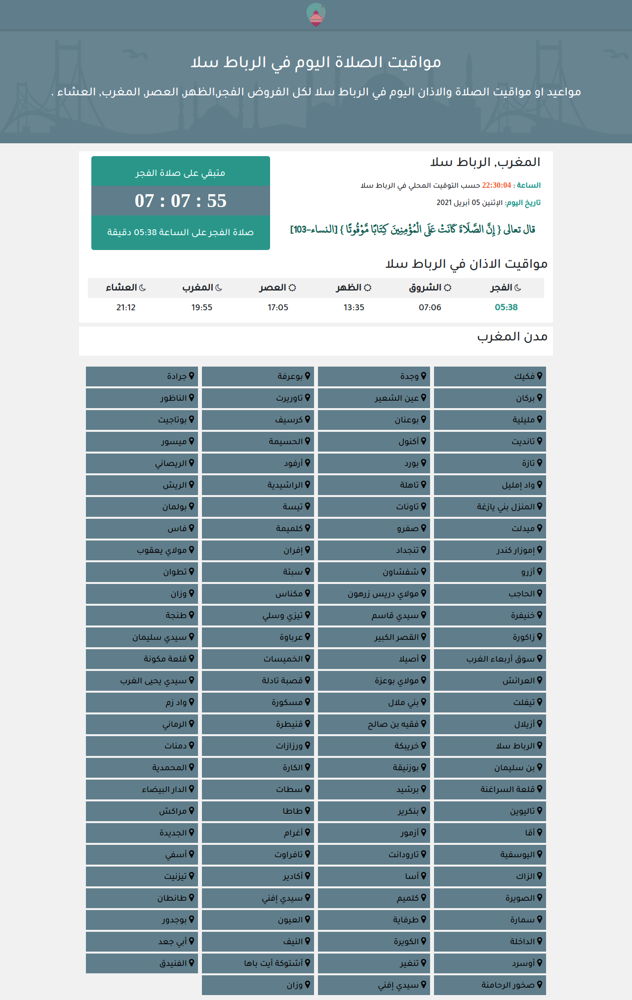

# Salat First

## Instalation

```bash=
git clone https://github.com/ZakariaMahmoud/SalatFirst.git

cd SalatFirst

npm install

ng serve
```
## Notice 
For this project I used the [Morocco-Prayer-Times-API](https://github.com/ZakariaMahmoud/Morocco-Prayer-Times-API)

## Screenshot



## Created by

* 🇲🇦 **Mahmoud Zakaria** 
* 🌐 [www.mahmoud.ma](https://www.mahmoud.ma/)
